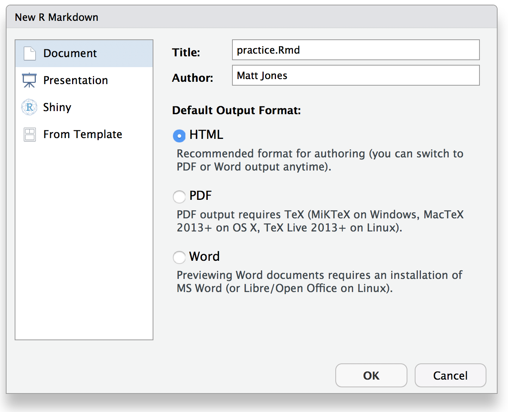

# Literate Analysis with RMarkdown

## Learning Objectives

In this lesson, you will learn:

- How plain text, Markdown, and RMarkdown differ
- How to write reports using RMarkdown
- How to integrate RMarkdown into your projects
- How RMarkdown enables literate and reproducible analysis

## What is (R)Markdown?

__Markdown__ is a text format that embeds formatting directives in plain text documents
in a natural way that doesn't interfere with naturally reading the document as a text
document.  This is conducive to preservation, as text documents are excellent archival
formats.  For example, here is the start of a markdown document:

```{markdown}
# Assessment report 

- _Division_: Commercial Fisheries
- _Date_: 2017-10-10
```

Plain text is a great way to write information down. Plain text has some major advantages:

- Works regardless of what decade you're trying to read the file, i.e. computers have and will continue to speak plain text but MS Word formats will continue to be a pain in the neck forever
- Works perfectly with version control software like git. MS Word does not.
- Easy to read, easy to write
- Can embed code right in the narrative for seamless reproducibility

Markdown is a plain text format that allows for common typesetting features including:

- Text formatting (bold, italic, etc.)
- Links
- Tables
- In-lined images
- Code

Markdown minimized the need for spending time typesetting, which is tedious 
and usually unnecessary. So if we want those kinds of things, we might want to 
use Markdown.

__RMarkdown__ is an extension to Markdown that allows several additional 
formatting directives, most notably code blocks that let you embed R
code in your document.  When the document is processed, the code blocks can be
executed, so that code output like figures can be included directly in the 
formatted document.  For example, here's a code block that generates a simple 
graph of random data in R (don't try this in Word!):

```{r randomplot, eval=TRUE, echo=TRUE}
library(ggplot2)
ggplot(data.frame(x=rnorm(100), y=rnorm(100)), aes(x, y)) + geom_point()
```

RMarkdown allows us to produce several kinds of output document (web, PDF, DOCX) 
based on this mix of Markdown and R code. This lets us write analyses in R as 
we already do but also write our reports/papers/etc. in R. Instead of the usual loop:

- Run analysis
- Copy and paste graphics and tables into Word
  + (forget where stuff came from)
- Edit/update report in Word

The loop becomes:

- Edit RMarkdown
- Generate fully reproducible report

Good resources:

- [http://rmarkdown.rstudio.com/](http://rmarkdown.rstudio.com/)
- [http://kbroman.org/knitr_knutshell/](http://kbroman.org/knitr_knutshell/)

## What's possible with RMarkdown

[RMarkdown](https://www.rstudio.com/wp-content/uploads/2015/03/rmarkdown-reference.pdf) 
supports a number of formatting directives. Some of the more useful include:

- Headings (H1 - H6)
- Formatting (__bold__, *italics*, ~~strikethrough~~, superscript^1^)
- Links: [Reproducible Analysis](https://nceas.github.io/sasap-training/materials/reproducible-analysis-in-r)
- Images
- Inline equations: $A = \pi*r^{2}$
- Lists
- Tables
- Code blocks
- Citations

For example, the 
[RMarkdown Reference Guide](https://www.rstudio.com/wp-content/uploads/2015/03/rmarkdown-reference.pdf) 
by RStudio shows how several of these directives would be formatted:


We will review each of these by building a an RMarkdown document from scratch in RStudio.  

## RMarkdown overview

Let's create a an RStudio project called `sasap-examples` to be used for the examples in
this tutorial.  From within RStudio choose *File | New Project...*, and create 
a project in a new directory:


Then, from within RStudio choose *File | New File | RMarkdown file*, and name
the file `practice.Rmd`


Then *Save* the file as `practice.Rmd`.  You'll note that RStudio filled in some 
example text in the Rmd file to get you started.

### Knitting the file

To see the rendered version of the file, hit the *Knit* button on the top of the 
editing pane, which will produce the formatted view of the file:


### Basic formatting

```
Use __bold__, *italics*, and ~~strikethough~~, and many others.
```

Use __bold__, *italics*, and ~~strikethough~~, and many others.

### Links

```
Links can be simply pasted in to show the whole URL like https://dataone.org, or
can be linked to a specific chunk of text, e.g., to the [DataONE](https://dataone.org) project.
```

Links can be simply pasted in to show the whole URL like https://dataone.org, or
can be linked to a specific chunk of text, e.g., to the [DataONE](https://dataone.org) project.

### Images

Images are like links, but prepended with an <code>!</code> exclamation point.

```

```


Note how relative paths can be used to locate the file in the `images` folder.

### R Code Chunks

Code chunks (also called fenced code blocks) are created using three sequential
backticks to start the block, then the name of the interpreter to use to execute
the code (usually *r*), and then three backticks to end the block.  For example:

<pre><code>```{r chunk-name-no-spaces, eval=TRUE} 
x <- 2
print(x^3)
```</code></pre>
 
```{r chunk-name-with-no-spaces, eval=TRUE, echo=FALSE}
x <- 2
print(x^3)
```

There are a large variety of 
[chunk options](http://rmarkdown.rstudio.com/lesson-3.html) for controlling the output.

### Inline R expressions and equations

```{r inline, eval=FALSE, echo=TRUE}
Just type what you want, like an equation like $\sqrt{2}$ that would be 
calculated with R as `r sqrt(2)`.
```

Just type what you want, like an equation like $\sqrt{2}$ that would be 
calculated with R as `r sqrt(2)`.

Formatting for equations uses [MathJax](https://math.meta.stackexchange.com/questions/5020/mathjax-basic-tutorial-and-quick-reference) to render even complicated equations nicely: $$\sum_{i=0}^n i^2 = \frac{(n^2+n)(2n+1)}{6}$$

### Plots

The power of code chunks in RMarkdown lies in the ability to generate graphs and
figures right inline.  You can use base graphics, or more advanced libraries like
`ggplot2` and `leaflet`.

Base graphics: Just run `plot(1:10)`

```{r base-graphics}
plot(1:10)
```

You can also use the full featues of `ggplot`:

```{r ggplot, eval=TRUE, echo=TRUE}
library(ggplot2)
ggplot(data.frame(x=rnorm(100), y=rnorm(100)), aes(x, y)) + geom_point()
```

Customize output sizing with chunk options: `fig.width`, `fig.height`, etc.

### Tables

You can render a simple table inline:

```
|   x |   y |   z |
|-----|-----|-----|
|   1 |   2 |   3 |
|   4 |   5 |   6 |
```

|   x |   y |   z |
|-----|-----|-----|
|   1 |   2 |   3 |
|   4 |   5 |   6 |

However, more likely, you'll want to format some data from a data frame as a
table that is pageable, searchable, and sortable. One really nice way is to use
`DT::datatable()`, like so:

```{r datatable}
data("mpg")
DT::datatable(mpg, caption="Mileage")
```

If you search around, there are tons of ways to do this. The simplest way is 
with the `kable` function from the `knitr` package, which is bare-bones but effective:

```{r}
data("mpg")
knitr::kable(head(mpg))
```

## Literate analysis with RMarkdown

The idea behind __literate analysis__ is to interleave the narrative of a scientific
project with its methods and code to seamlessly document the exact relationships
among the prose, the figures and tables, the code that produced them, and the data
that was used by the code.  Literate analysis is the inverse of *commenting your code*,
as it lets you turn your paper into a *living, executable analysis*.  A literate analysis
using RMarkdown is fully reproducible, in that everything needed to understand the 
analysis and reproduce it is directly in the document.   When done well, a user
should be able to trace from the raw data through all data cleaning, integration,
analysis, modeing, and visualization steps that lead to the final set of figures
and tables that are embedded directly in the narrative.

While an RMarkdown document is a single, linear exposition of a project, you can still
modularize your code with functions and packages to make the code both more readable
and more re-usable.  While one can certainly define functions within an
RMarkdown document, for most analyses of even moderate complexity, we recommend separating
functions into separate files and packages that can be defined and reused.  The 
package `rrtools` [@marwick_rrtools_010] provides a convenient convention for 
organizing code into reusable modules using R's standard package layout.

## Organizing a reproducible research folder

The `rrtools` package creates a folder convention for keeping code, data, and research
results organized. For a project named `sasap_training`, the `rrtools` package 
could be used to organize and structure the project in a standard way. To start
a project with RRtools, use:

```{r rrtools, eval=FALSE, echo=TRUE}
# Install package (run if needed)
# remotes::install_github("benmarwick/rrtools")

rrtools::use_compendium("sasap_training")

# Then, from within the created package, run:
rrtools::use_readme_rmd()
rrtools::use_analysis()
```

which produces a new RStudio project with specific folders for each type of data and
code for the analysis with the following layout:

```
sasap_training
├── CONDUCT.md
├── CONTRIBUTING.md
├── DESCRIPTION
├── R
│   ├── data_load.R
│   ├── diversity_functions.R
│   ├── stock_functions.R
├── README.Rmd
├── analysis
│   ├── data
│   │   ├── derived_data
│   │   │   ├── salmon_asl_integrated.csv
│   │   └── raw_data
│   │   │   ├── salmon_asl_southeast.csv
│   │   │   ├── salmon_asl_central.csv
│   │   │   ├── salmon_asl_kuskokwim.csv
│   ├── figures
│   │   │   ├── figure_01.png
│   ├── paper
│   │   ├── journal-of-archaeological-science.csl
│   │   ├── paper.Rmd
│   │   └── references.bib
└── salmonstock.Rproj
```

In this structure, untouched raw data would go in the `analysis/data/raw_data` folder,
re-usable code functions go in the `R` folder, and the Rmd file associated with
the manuscript goes into `analysis/paper/paper.Rmd` along with associated bibliographic
files.  Note that the data in `derived_data` would ideally be produced by running
the code in `paper.Rmd`, which would execute functions from `data_load.R` to create
the derived data file, which in turn would be analyzed and visualized by other functions
found in the `R` folder.  In this way, the complete analysis from raw data through to a
completely formatted manuscript would be represented by the `paper.Rmd`, with all
data and dependencies fully specified.  This is truly a reproducible computation.

- Further reading: [@marwick_packaging_2017]

