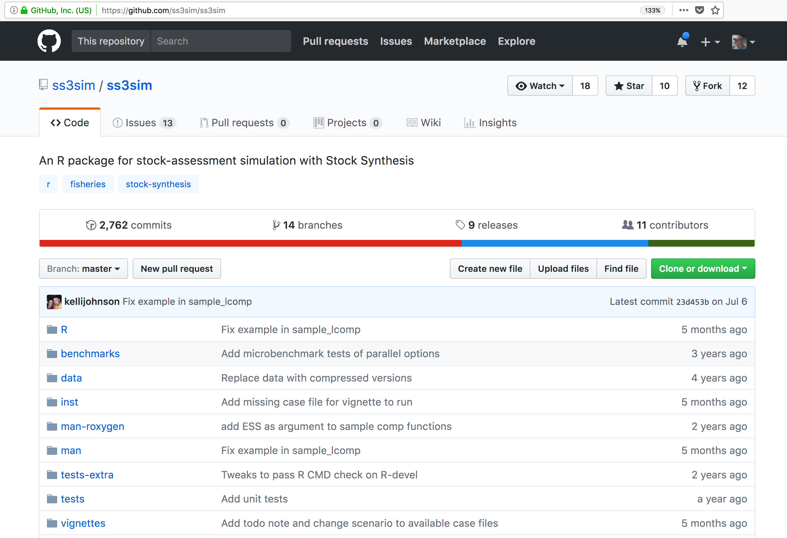

# Version Control With git and GitHub

Instructor: Matt Jones

## Learning Objectives

In this lesson, you will learn:

- Why __git__ is useful for reproducible analysis
- How to use __git__ to track changes to your work over time
- How to use __GitHub__ to collaborate with others
- How to structure your commits so your changes are clear to others
- How to write effective commit messages
- How to tag a release of your work for later reference

## The problem with filenames

Every file in the scientific process changes.  Manuscripts are edited.
Figures get revised.  Code gets fixed when problems are discovered.  Data files
get combined together, then errors are fixed, and then they are split and 
combined again. In the course of a single analysis, one can expect thousands of
changes to files.  And yet, all we use to track this are simplistic *filenames*.  
You might think there is a better way, and you'd be right: __version control__.

Version control systems help you track all of the changes to your files, without
the spaghetti mess that ensues from simple file renaming.  In version control systems
like `git`, the system tracks not just the name of the file, but also its contents,
so that when contents change, it can tell you which pieces went where.  It tracks
which version of a file a new version came from.  So its easy to draw a graph
showing all of the versions of a file, like this one:

Version control systems assign an identifier to every version of every file, and 
track their relationships. They also allow branches in those versions, and merging
those branches back into the main line of work.  They also support having 
*multiple copies* on multiple computers for backup, and for collaboration.
And finally, they let you tag particular versions, such that it is easy to return 
to a set of files exactly as they were when you tagged them.  For example, the 
exact versions of data, code, and narrative that were used when a manuscript was 
submitted might be `R2` in the graph above.

## Version control and Collaboration using Git and GitHub

Let's distinguish between git and GitHub:

- __git__: version control software used to track files in a folder (a repository)
    - git creates the versioned history of a repository
- __GitHub__: web site that allows users to store their git repositories and share them with others

## Let's look at a GitHub repository

This screen shows the copy of a repository stored on GitHub,
with its list of files, when the files and directories were last modified, 
and some information on who made the most recent changes.  

If we drill into the 
"commits" for the repository, we can see the history of chnages made to all of 
the files.  Looks like `kellijohnson` and `seananderson` were fixing things in
June and July:

And finally, if we drill into the changes made on June 13, we can see exactly what
was changed in each file:

Tracking these changes, how they relate to released versions of software and files
is exactly what Git and GitHub are good for.  And we will show how they can really 
be effective for tracking versions of scientific code, figures, and manuscripts
to accomplish a reproducible workflow.

## Working remotely with GitHub

### Create a repository

- Log into [GitHub](https://github.com)
- Click the 
- Name it `sasap-examples`
- Create a README.md
- Choose a LICENSE

- Edit the README.md file in GitHub

- Copy the GitHub clone URI

## The Git lifecycle

- git clone
- git add
- git commit
- git pull
- git push

- git status
- git history

## Working locally with Git via RStudio

- Pull from the OSS lesson

## Advanced topics

Optional topics, not to be covered:

- Using git on the command line
- gitignore to protect sensitive data
- Resolving conflicts
- Issues
  - What are
  - How to effectively
- The PR model vs. direct contributor model of git collaboration

