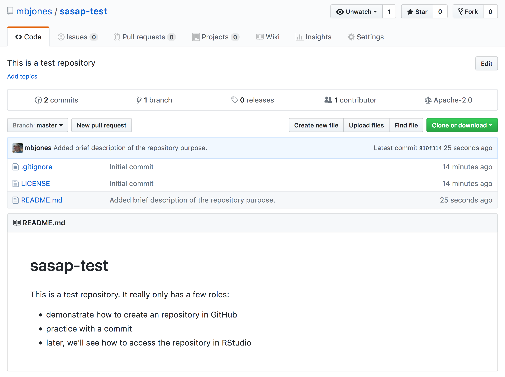

# Version Control With git and GitHub

Instructor: Matt Jones

## Learning Objectives

In this lesson, you will learn:

- Why __git__ is useful for reproducible analysis
- How to use __git__ to track changes to your work over time
- How to use __GitHub__ to collaborate with others
- How to structure your commits so your changes are clear to others
- How to write effective commit messages
- How to tag a release of your work for later reference

## The problem with filenames

Every file in the scientific process changes.  Manuscripts are edited.
Figures get revised.  Code gets fixed when problems are discovered.  Data files
get combined together, then errors are fixed, and then they are split and 
combined again. In the course of a single analysis, one can expect thousands of
changes to files.  And yet, all we use to track this are simplistic *filenames*.  
You might think there is a better way, and you'd be right: __version control__.

Version control systems help you track all of the changes to your files, without
the spaghetti mess that ensues from simple file renaming.  In version control systems
like `git`, the system tracks not just the name of the file, but also its contents,
so that when contents change, it can tell you which pieces went where.  It tracks
which version of a file a new version came from.  So its easy to draw a graph
showing all of the versions of a file, like this one:

Version control systems assign an identifier to every version of every file, and 
track their relationships. They also allow branches in those versions, and merging
those branches back into the main line of work.  They also support having 
*multiple copies* on multiple computers for backup, and for collaboration.
And finally, they let you tag particular versions, such that it is easy to return 
to a set of files exactly as they were when you tagged them.  For example, the 
exact versions of data, code, and narrative that were used when a manuscript was 
submitted might be `R2` in the graph above.

## Version control and Collaboration using Git and GitHub

Let's distinguish between git and GitHub:

- __git__: version control software used to track files in a folder (a repository)
    - git creates the versioned history of a repository
- __GitHub__: web site that allows users to store their git repositories and share them with others

## Let's look at a GitHub repository

This screen shows the copy of a repository stored on GitHub,
with its list of files, when the files and directories were last modified, 
and some information on who made the most recent changes.  

If we drill into the 
"commits" for the repository, we can see the history of changes made to all of 
the files.  Looks like `kellijohnson` and `seananderson` were fixing things in
June and July:

And finally, if we drill into the changes made on June 13, we can see exactly what
was changed in each file:

Tracking these changes, how they relate to released versions of software and files
is exactly what Git and GitHub are good for.  And we will show how they can really 
be effective for tracking versions of scientific code, figures, and manuscripts
to accomplish a reproducible workflow.

## The Git lifecycle

As a git user, you'll need to understand the basic concepts associated with versioned
sets of changes, and how they are stored and moved across repositories.  Any given
git repository can be cloned so that it exist both locally, and remotely.  But each of
these cloned repositories is simply a copy of all of the files and change history
for those files, stored in git's particular format.  For our purposes, we can consider
a git repository just a folder with a bunch of additional version-related metadata.

In a local git-enabled folder, the folder contains a workspace containing the 
current version of all files in the repository. These working files are linked to
a hidden folder containing the 'Local repository', which contains all of the other
changes made to the files, along with the version metadata.

So, when working with files using git, you can use git commands to indicate specifically
which changes to the local working files should be staged for versioning 
(using the `git add` command), and when to record those changes as a version in
the local repository (using the command `git commit`).

The remaining concepts are involved in synchronizing the changes in your local 
repository with changes in a remote repository.  The `git push` command is used to
send local changes up to a remote repository (possibly on GitHub), and the `git pull`
command is used to fetch changes from a remote repository and merge them into the
local repository.

- `git clone`: to copy a whole remote repository to local
- `git add` (stage): notify git to track particular changes
- `git commit`: store those changes as a version
- `git pull`: merge changes from a remote repository to our local repository
- `git push`: copy changes from our local repository to a remote repository
- `git status`: determine the state of all files in the local repository
- `git log`: print the history of changes in a repository

Those seven commands are the majority of what you need to successfully use git.  
But this is all super abstract, so let's explore with some real examples.

## Create a remote repository on GitHub

Let's start by creating a repository on GitHub, then we'll edit some files.

- Log into [GitHub](https://github.com)
- Click the New repository button
- Name it `sasap-test`
- Create a README.md
- Set the LICENSE to Apache 2.0

You've now created your first repository! It has a couple of files that GitHub created
for you, like the README.md file, and the LICENSE file, and the .gitignore file.

For simple changes to text files, you can make edits right in the GitHub web interface.  For example,
navigate to the `README.md` file in the file listing, and edit it by clicking on the *pencil* icon.
This is a regular Markdown file, so you can just add text, and when done, add a commit message, and 
hit the `Commit changes` button.  

Congratulations, you've now authored your first versioned commit.  If you navigate back to 
the GitHub page for the repository, you'll see your commit listed there, as well as the
rendered README.md file.

Let's point out a few things about this window.  It represents a view of the repository
that you created, showing all of the files in the repository so far.  For each file,
it shows when the file was last modified, and the commit message that was used to last
change each file.  This is why it is important to write good, descriptive commit
messages.  In addition, the blue header above the file listing shows the most recent
commit, along with its commit message, and its SHA identifer.  That SHA identifier is
the key to this set of versioned changes.  If you click on the SHA identifier (*810f314*), 
it will display the set of changes made in that particular commit.

In the next section we'll use the GitHub URL for the GitHub repository you created 
to `clone` the repository onto your local machine so that you can edit the files 
in RStudio.  To do so, start by copying the GitHub URL, which represents the repository
location:

## Working locally with Git via RStudio

RStudio knows how to work with files under version control with Git, but only if
you are working within an RStudio project folder.  In this next section, we will
clone the repository that you created on GitHub into a local repository as an 
RStudio project.

- Create the new project
- Inspect the Git tab and version history
- Make a change to the README.md file
- Inspect the version history
- Add and commit an Rmd file
- Push these changes to GitHub

## Good commit messages make good neighbors

## Conflict free workflows

## Advanced topics

Optional topics, not to be covered:

- Using git on the command line
- gitignore to protect sensitive data
- Resolving conflicts
- Issues
  - What are
  - How to effectively
- The PR model vs. direct contributor model of git collaboration

