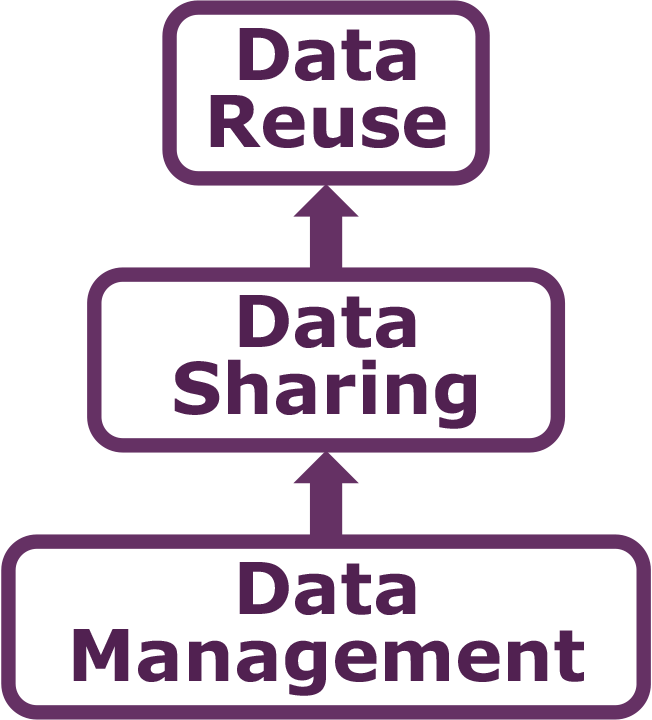
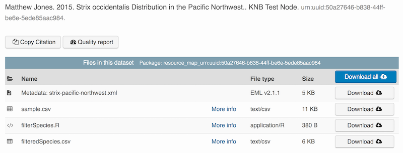

# Data Documentation and Publishing 

## Learning Objectives

In this lesson, you will learn:

- About open data archives
- What science metadata is and how it can be used
- How data can be documented and published in open data archives

## Data sharing and preservation



## Data repositories: built for data (and code)

- GitHub is not an archival location
- Dedicated data repositories: KNB, Arctic Data Center, Zenodo, FigShare
  + Rich metadata
  + Archival in their mission
- Data papers, e.g., Scientific Data
- List of data repositories: http://re3data.org


## Metadata

- Show https://knb.ecoinformatics.org/#view/doi:10.5063/F1F18WN4


## Structure of a data package


## DataONE Federation

- what is it?
- Member repositories and search
- https://search.dataone.org/


## Accessing archival data on the KNB

- https://knb.ecoinformatics.org/#view/doi:10.5063/F1F18WN4

```{r salmondata, eval=FALSE}
library(dataone)
library(datapack)
metadata_id <- "doi:10.5063/F1F18WN4"

d1c <- D1Client("PROD", "urn:node:KNB")
pkg <- getDataPackage(d1c, metadata_id)
md <- getMember(pkg, "doi:10.5063/F1F18WN4")
o <- getMember(pkg, getIdentifiers(pkg)[[1]])
```

## Publishing data from the web

- Walk through web submission UI on https://test.arcticdata.io

## Publishing data from R

This document describes how to use the *dataone* R package to upload data to DataONE
member repositories like the [KNB Data Repository](https://knb.ecoinformatics.org) and the [Arctic Data Center](https://arcticdata.io).

The *dataone* R package provides methods to enable R scripts to interact with DataONE to search for, download, upload and update data and metadata. The *dataone* R package represents the set of files in a data set as a `datapack::DataPackage`.  We will create a `DataPackage` locally, and then upload it to a test version of the Arctic Data Center repository using `dataone`.

## Logging in
Before uploading any data to a DataONE repository, you must login to get an *authentication token*, which is a character string used to identify yourself. This token can be retrieved by logging into the test repository and copying the token into your R session.

### Obtain an ORCID
ORCID is a researcher identifier that provides a common way to link your researcher identity to your articles and data.  An ORCID is to a researcher as a DOI is to a research article.  To obtain an ORCID, register at https://orcid.org.

### Log in to to the test repository and copy your token
We will be using a test server, so login and retrieve your token at https://test.arcticdata.io

Once you are logged in, navigate to your Profile Settings, and locate the "Authentication Token" section, and then copy the token for R to your clipboard.


Finally, paste the token into the R Console to register it as an option for this R session.  You are now logged in.  But note that you need to keep this token private; don't paste it into scripts or check it into Git, as it is just as sensitive as your password.

## Modify metadata
Next, modify the metadata file associated with the package to set yourself as the owner.  This will help us differentiate the test data later.  Open the `strix-pacific-northwest.xml` file in RStudio, and change the `givenName` and `surName` fields at the top to your name.

```{r modify-eml, eval=FALSE}
library(EML)
# devtools::install_github("NCEAS/arcticdatautils")
#library(arcticdatautils)
source("misc/eml_helpers.R")

# Load the EML file into R
emlFile <- "data/strix/strix-pacific-northwest.xml"
doc <- read_eml(emlFile)

# Change creator to us
doc@dataset@creator <- c(eml_creator("Matthew", "Jones", email = "jones@nceas.ucsb.edu"))

# Change abstract to the better one we wrote
doc@dataset@abstract <- as(set_TextType("data/strix/better-abstract.md"), "abstract")

# Save it back to the filesystem
write_eml(doc, emlFile)
```

## Uploading A Package Using `uploadDataPackage`
Datasets and metadata can be uploaded individually or as a collection. Such a collection, whether contained in local 
R objects or existing on a DataONE repository, will be informally referred to as a `package`. The steps necessary to
to prepare and upload a package to DataONE using the `uploadDataPackage` method 
will be shown. A complete script that uses these steps is shown here.

In the first section, we create a 'DataPackage as a container for our data and metadata and scripts:

```{r data-package, eval=FALSE}
library(dataone)
library(datapack)
library(uuid)

d1c <- D1Client("STAGING", "urn:node:mnTestARCTIC")
dp <- new("DataPackage")
show(dp)
```

We then add a metadata file, data file, R script and output data file to this package:
```{r build-package, eval=FALSE}
# Generate identifiers for our data and program objects, and add them to the metadata
sourceId <- paste0("urn:uuid:", uuid::UUIDgenerate())
progId <- paste0("urn:uuid:", uuid::UUIDgenerate())
outputId <- paste0("urn:uuid:", uuid::UUIDgenerate())
doc@dataset@otherEntity[[1]]@id <- new("xml_attribute", sourceId)
doc@dataset@otherEntity[[2]]@id <- new("xml_attribute", progId)
doc@dataset@otherEntity[[3]]@id <- new("xml_attribute", outputId)
repo_obj_service <- paste0(d1c@mn@endpoint, "/object/")
doc@dataset@otherEntity[[1]]@physical[[1]]@distribution[[1]]@online@url <- 
  new("url", paste0(repo_obj_service, sourceId))
doc@dataset@otherEntity[[2]]@physical[[1]]@distribution[[1]]@online@url <- 
  new("url", paste0(repo_obj_service, progId))
doc@dataset@otherEntity[[3]]@physical[[1]]@distribution[[1]]@online@url <- 
  new("url", paste0(repo_obj_service, outputId))

write_eml(doc, emlFile)

# Add the metadata document to the package
metadataObj <- new("DataObject", 
                   format="eml://ecoinformatics.org/eml-2.1.1", 
                   filename=paste(getwd(), emlFile, sep="/"))
dp <- addMember(dp, metadataObj)

# Add our input data file to the package
sourceData <- "data/strix/sample.csv"
sourceObj <- new("DataObject",
                 id = sourceId,
                 format="text/csv", 
                 filename=paste(getwd(), sourceData, sep="/"))
dp <- addMember(dp, sourceObj, metadataObj)

# Add our processing script to the package
progFile <- "data/strix/filterSpecies.R"
progObj <- new("DataObject",
               id = progId,
               format="application/R", 
               filename=paste(getwd(), progFile, sep="/"), 
               mediaType="text/x-rsrc")
dp <- addMember(dp, progObj, metadataObj)

# Add our derived output data file to the package
outputData <- "data/strix/filteredSpecies.csv"
outputObj <- new("DataObject", 
               id = outputId,
               format="text/csv", 
               filename=paste(getwd(), outputData, sep="/"))
dp <- addMember(dp, outputObj, metadataObj)

myAccessRules <- data.frame(subject="http://orcid.org/0000-0003-0077-4738", permission="changePermission") 

# Add the provenance relationships to the data package
dp <- describeWorkflow(dp, sources=sourceObj, program=progObj, derivations=outputObj)

show(dp)
```

Finally, we upload the package to the Testing server for the KNB.
```{r upload-package, eval=FALSE}
packageId <- uploadDataPackage(d1c, dp, public=TRUE, accessRules=myAccessRules, quiet=FALSE)
```

This particular package contains the R script `filterSpecies.R`, the input 
file `sample.csv` that was read by the script and the output file 
`filteredSpecies.csv` that was created by the R script, which was run at a
previous time.  

You can now search for and view the package at https://dev.nceas.ucsb.edu:



In addition, each of the uploaded entities shows the relevant provenance information, showing how the source data is linked to the derived data via the R program that was used to process the raw data:


