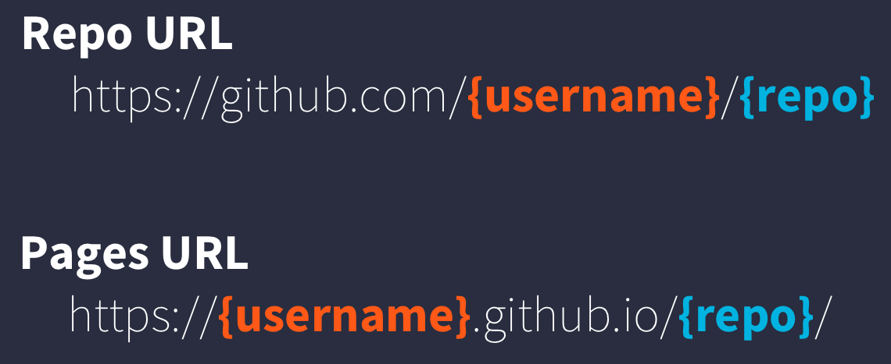

# Publishing Analyses to the Web

## Learning Objectives

In this lesson, you will learn:

- How to use git, GitHub (+Pages), and (R)Markdown to publish an analysis to the web

## Introduction

Sharing your work with others in engaging ways is an important part of the scientific process.
So far in this course, we've introduced a small set of powerful tools for doing open science:

- R and its many packages
- RStudio
- git
- GiHub
- RMarkdown

RMarkdown, in particular, is amazingly powerful for creating scientific reports but, so far, we haven't tapped its full potential for sharing our work with others.

In this lesson, we're going to take an existing GitHub repository and turn it into a beautiful and easy to read web page using the tools listed above.

## A Minimal Example

- Create a new repository on GitHub
- Initialize the repository on GitHub without any files in it
- In RStudio,
    - Create a new Project
    - When creating, select the option to create from Version Control -> Git
    - Enter your repository's clone URL in the Repository URL field and fill in the rest of the details
- Add a new file at the top level called `index.Rmd`. The easiest way to do this is through the RStudio menu. Choose File -> New File -> RMarkdown...  This will bring up a dialog box. You should create a "Document" in "HTML" format. These are the default options.
- Open `index.Rmd` (if it isn't already open)
- Press Knit

    Observe the rendered output
    Notice the new file in the same directory `index.html`.
    This is our RMarkdown file rendered as HTML (a web page)
- Commit your changes (to both index.Rmd and index.html)
- Open your web browser to the GitHub.com page for your repository
- Go to Settings > GitHub Pages and turn on GitHub Pages for the `master` branch

    Now, the rendered website version of your repo will show up at a special URL.
    
    GitHub Pages follows a convention like this:
    
     
     
    Note that it will no longer be at github.com but github.io
     
- Go to https://{username}.github.io/{repo_name}/ (Note the trailing `/`)
    Observe the awesome rendered output
    
Now that we've successfully published a web page from an RMarkdown document, let's make a change to our RMarkdown document and follow the steps to actually publish the change on the web:

- Go back to our `index.Rmd`
- Delete all the content, except the YAML frontmatter
- Type "Hello world"
- Commit, push
- Go back to https://{username}.github.io/{repo_name}/

## A Less Minimal Example

Now that we've seen how to create a web page from RMarkdown, let's create a website that uses some of the cool functionality available to us.
We'll use the same git repository and RStudio Project as above, but we'll be adding some files to the repository and modifying `index.Rmd`.

First, let's get some data.
We'll re-use the salmon escapement data from the ADF&G OceanAK database we used earlier.

- Navigate to [Escapement Counts](https://knb.ecoinformatics.org/#view/urn:uuid:c14d3e59-e5e3-4696-996d-558446b577fd) (or visit the KNB and search for 'oceanak') and copy the Download URL for the `ADFG_firstAttempt_reformatted.csv` file
- Make a folder in the top level of your repository to store the file called `data`
- Download that file into the `data` folder with the filename `escapement_counts.csv`

    Note that this is different than how we've been downloading data in earlier lessons because we're actually going to commit the data file into git this time.

- Calculate median annual escapement by species using the `dplyr` package
- Display it in an interactive table with the `datatable` function from the `DT` package
- Make a bar plot of the median annual escapement by species using the `ggplot2` package

And lastly, let's make an interactive, Google Maps-like map of the escapement sampling locations.
To do this, we'll use the [`leaflet`](https://rstudio.github.io/leaflet/) package to create an interactive map with markers for all the sampling locations:

First, let's load the packages we'll need:

```{r}
suppressPackageStartupMessages({
  library(leaflet)
  library(dplyr)
  library(tidyr)
  library(ggplot2)
  library(DT)
})
```

Then, let's create the `data.frame` we're going to use to plot:

```{r, cache=TRUE}
esc <- read.csv(url("https://knb.ecoinformatics.org/knb/d1/mn/v2/object/knb.92020.1", method = "libcurl"), 
                stringsAsFactors = FALSE)

```

Now that we have the data loaded, let's calculate median annual escapement by species:

```{r}
median_esc <- esc %>% 
  separate(sampleDate, c("Year", "Month", "Day"), sep = "-") %>% 
  group_by(Species, SASAP.Region, Year, Location) %>% 
  summarize(escapement = sum(DailyCount)) %>% 
  group_by(Species) %>% 
  summarize(median_escapement = median(escapement))
```

```{r}
ggplot(median_esc, aes(Species, median_escapement)) +
  geom_col() +
  coord_flip()
```

Calculate median annual escapement by species using the `dplyr` package
Let's convert the escapement data into a table of just the unique locations:

```{r}
locations <- esc %>% 
  distinct(Location, Latitude, Longitude) %>% 
  drop_na()
```

And display it as an interactive table:

```{r}
datatable(locations)
```

Then making a leaflet map is only a couple of lines of code:

```{r}
leaflet(locations) %>% 
  addTiles() %>% 
  addMarkers(~ Longitude, ~ Latitude, popup = ~ Location)
```


The `addTiles()` function gets a base layer of tiles from [OpenStreetMap](https://www.openstreetmap.org/) which is an open alternative to Google Maps.
`addMarkers` use a bit of an odd syntax in that it looks kind of like `ggplot2` code but uses `~` before the column names.
This is similar to how the `lm` function (and others) work but you'll have to make sure you type the `~` for your map to work.

While we can cleary see there are some serious isues with our data (note the points in Russia), this map hopefully gives you an idea of how powerful RMarkdown can be.
