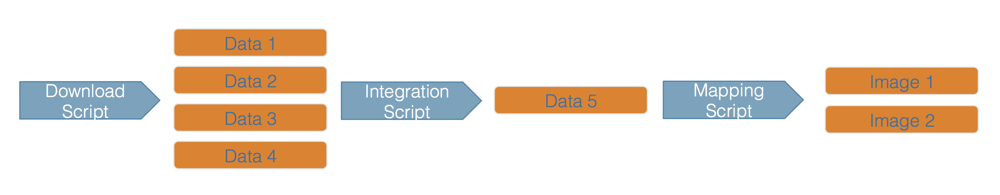
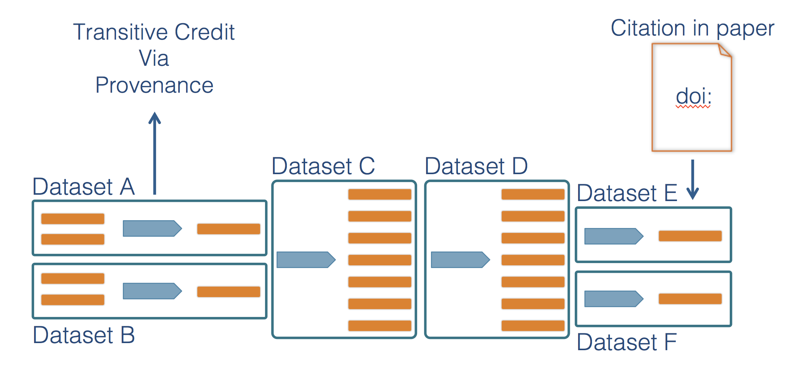
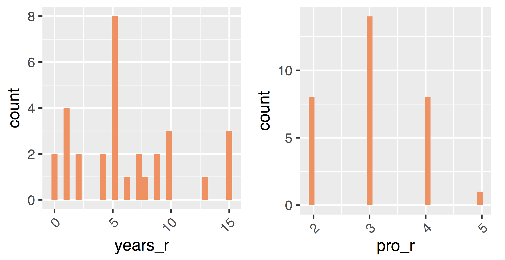

--- 
title: "Intridución a RMarkdown"
date: "???, 2019"
site: bookdown::bookdown_site
output: bookdown::gitbook
documentclass: book
bibliography: [book.bib]
biblio-style: apalike
link-citations: yes
description: "Una aproximación aplicada a la ciencia abierta, investigación reproducible y manejo de datos en R"
always_allow_html: yes
---

_**Reconocimiento**_: Gran parte de los documentos introductorios son una traducción libre desde al material preparado 
y compartido por el grupo [SASAP](https://alaskasalmonandpeople.org/) del [NCEAS](https://www.nceas.ucsb.edu/) en su sitio [SASAP-Training](https://github.com/NCEAS/sasap-training) de en [GitHub](https://github.com/).


# Introducción

La reproducibilidad es fundamental en la ciencia, ya que la ciencia está basada en observaciones empíricas acopladas a modelos explicativos. 

While reproducibility encompasses 
the full science lifecycle, and includes issues such as methodological consistency and
treatment of bias, in this course we will focus on **computational reproducibility**: 
the ability to document data, analyses, and models sufficiently for other researchers 
to be able to understand and ideally re-execute the computations that led to 
scientific results and conclusions.

## The Reproducibility Crisis

@ioannidis_why_2005 highlighted a growing crisis in reproducibility of science when 
he wrote that "Most Research Findings Are False for Most Research Designs 
and for Most Fields". Ioannidis outlined ways in which the research process
has lead to inflated effect sizes and hypothesis tests that codify existing biases.
Subsequent research has confirmed that reproducibility is low across many fields,
including genetics [@ioannidis_repeatability_2009], ecology [@fraser_questionable_2018], and 
psychology [@open_science_collaboration_estimating_2015], among others.  For example,
effect size has been shown to significantly decrease in repeated experiments in 
psychology (\@ref(fig:effectsize)).

```{r effectsize, echo=FALSE, out.width = '100%', fig.align = 'center', fig.cap = 'Effect size decreases in replicated experiments [@open_science_collaboration_estimating_2015].'}
knitr::include_graphics("images/effect-size.png")
```

## What is needed for computational reproducibility?

The first step towards addressing these issues is to be able to evaluate the data,
analyses, and models on which conclusions are drawn.  Under current practice, 
this can be difficult because data are typically unavailable, the method sections
of papers do not detail the computational approaches used, and analyses and models
are often conducted in graphical programs, or, when scripted analyses are employed,
the code is not available.

And yet, this is easily remedied.  Researchers can achieve computational 
reproducibility through open science approaches, including straightforward steps 
for archiving data and code openly along with the scientific workflows describing 
the provenance of scientific results (e.g., @hampton_tao_2015, @munafo_manifesto_2017).

## Conceptualizing workflows

Scientific workflows encapsulate all of the steps from data acquisition, cleaning,
transformation, integration, analysis, and visualization.  

```{r workflow, echo=FALSE, out.width = '100%', fig.align = 'center', fig.cap = 'Scientific workflows and provenance capture the multiple steps needed to reproduce a scientific result from raw data.'}

```

Workflows can range in detail from simple flowcharts (\@ref(fig:workflow))
to fully executable scripts. R scripts and python scripts are a textual form 
of a workflow, and when researchers publish specific versions of the scripts and 
data used in an analysis, it becomes far easier to repeat their computations and 
understand the provenance of their conclusions.

Within many science disciplines, researchers are seeing the power of building reproducible
workflows.  For example, within fisheries science, the [ICES Transparent Assessment Framework (TAF)](http://ices.dk/marine-data/tools/Pages/transparent-assessment-framework.aspx) is
being developed to help researchers share stock assessments consistently and completely (\@ref(fig:ices)).

```{r ices, echo=FALSE, out.width = '100%', fig.align = 'center', fig.cap = 'ICES Transparent Assessment Framework'}
knitr::include_graphics("images/ices-taf.png")
```

## Credit where credit is due

A major advantage of preserving the details of scientific workflows (data, inputs, outputs, and code) is that data citations become so much more effective.  Today, driver data sets like global environmental variables, code libraries, and simulated data are critical to many scientific outcomes, but are rarely if ever cited.  By preserving scientific workflows, a citation to a highly derived product can be traced back through its chain of provenance to give credit to the researchers and analysts that created those critical precursor products (\@ref(fig:transitive)).  Which also helps with a full understanding of just how conclusions were made in an analysis.

```{r transitive, echo=FALSE, out.width = '100%', fig.align = 'center', fig.cap = 'Scientific workflows provenance allows credit to be assigned to precursor data and analytical work.'}

```

## Course Objectives

This event will cover techniques for building reproducible analysis workflows using the R programming language through a series of hands-on coding sessions. We will use examples from integrating salmon brood data across the state of Alaska to show how heterogeneous data can be cleaned, integrated, and documented through workflows written in RMarkdown. After an overview of the use of RMarkdown for literate analysis, we will dive into critical topics in data science, including version control, data modeling, cleaning, and integration, and then data visualization both for publications and the web.  Major topics will include:

- Literate analysis using RMarkdown
- Version control for managing scientific code
- Data modeling, cleaning, and integration
- Publishing data and **code**
- Data visualization for the web

## Course details

This mini-course will be a hands-on experience, with most of the material presented 
through a series of tutorials.  It is meant as a survey of techniques that will
motivate participants to continue self-study in reproducible science.

While prior knowledge of R is a pre-requisite for the mini-course, participants 
enter with a range of experience with scientific computing in R.  We will try to
accommodate this diversity, while maintaining a reasonable pace through the materials.




We will conduct the course in a supportive and friendly manner, working to build
skills, confidence, and curiosity about data science.  We encourage an informal
atmosphere, where questions and discussion are welcome.
