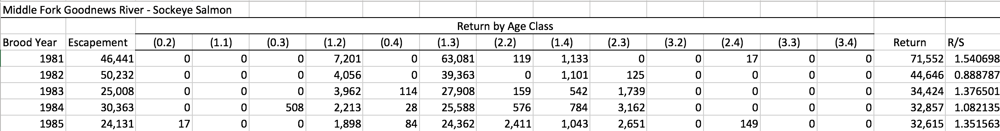
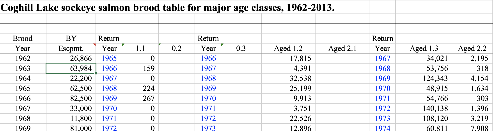

--- 
title: "Reproducible Analysis With R"
date: "November 28-29, 2017"
site: bookdown::bookdown_site
output: bookdown::gitbook
documentclass: book
bibliography: [book.bib]
biblio-style: apalike
link-citations: yes
description: "Practical open science approaches to salmon data management, analysis, and synthesis"
always_allow_html: yes
---

# Introduction

Placeholder


## The Reproducibility Crisis
## What is needed for computational reproducibility?
## Conceptualizing workflows
## Course Objectives
## Course details

<!--chapter:end:index.Rmd-->

# Example: Brood Table Analysis

```{r package loading, echo = FALSE, warning = FALSE, message = FALSE}
library(readxl)
library(ggplot2) # For making plots at the end
library(kableExtra)
library(leaflet)
library(knitr)
library(dplyr)
library(ggpmisc)
library(DT)
```

## Introduction

Brood tables, also called run reconstructions, utilize annual estimates of the total run (commercial catch plus escapement), and samples of ages, to estimate the number of recruits per age class. These data are useful for salmon biologists to understand salmon productivity and salmon life histories.

These data can come in a number of different formats, but generally follow the pattern of:
1. Rows for each brood year
2. Columns for the estimated number of fish in each age class.

See the example below, showing a Sockeye salmon brood table from the Goodnews River, Alaska:



Sometimes other columns are included, such as return years in this example (again for Sockeye salmon) from Coghill Lake, Alaska:



If you are interested in analysing trends across multiple stocks, the many different ways brood tables can be presented make integrating multiple brood tables a big challenge. In this exercise we will intoduce some ways to reformat, merge, and reshape a set of brood tables from around the state of Alaska. These datasets were gathered as part of the [SASAP working group](https://alaskasalmonandpeople.org/) research from a number of different ADFG offices. We will start with the raw (unmodified) data for each stock, run each stock’s brood table through a separate R script to normalize the format, integrate all of the brood tables together, and finally do an exploratory analysis across stocks.

## Datasets

As part of the SASAP project, brood tables for 48 Sockeye salmon stocks were collected. Table 2.1 shows a list of these stocks, along with other regional and location information.

```{r, echo = FALSE}
stocks <- read.csv('data/original/StockInfo.csv', stringsAsFactors = F)
```

```{r, echo = FALSE}
datatable(stocks[, c('Stock.ID','Stock' ,'Region', 'Sub.Region')], rownames = FALSE, caption = "Stock information")
```

These stocks range geographically from Washington to Alaska. Although temporal coverage varies by stock, many of the brood tables were updated in 2016, and some have reconstructions dating back to 1922. 

Figure 2.1 indicates the approximate location of the salmon stocks in Table 2.1.

```{r, echo = FALSE}
salmon = makeIcon('images/salmon_tiny.png',
                  'images/salmon_big.png',
                  26, 14)

m <- leaflet(stocks)  %>%
  setView(-median(stocks$Lon), median(stocks$Lat), zoom = 4) %>%
  addTiles() %>% 
  addMarkers(~-Lon, ~Lat, icon = salmon)

m

```

Figure 2.1: Location of stocks used in this data integration. Salmonid icon by Servien (vectorized by T. Michael Keesey) [CC-BY-SA](https://creativecommons.org/licenses/by-sa/3.0/), available at [Phylopic](http://phylopic.org/).

## Reformatting

First we need to change the brood table column names so that they are in a consistent format. Here we show an example of how one of our source tables (Coghill Lake, from above) is reformatted. Prior to diving into reformatting, it is good to have an idea of what columns will be necessary in your merged data table. To identify different stocks, certainly a column will be needed for the stock name (usually a river name) and the species. If you wish to analyze across different regions or areas, you may want to have a column for region as well. Of course you will also need columns for brood year and all of the possible age classes you might encounter. A quality flag indicating whether data should be used in analysis or not based on set critera is also useful. Finally, it is also a good idea to have a unique identifier for each brood table that goes into the merged data table so that you can easily add data by stock, or summarize data by stock. With that in mind, we will be reformatting all of the brood tables so they have the following column names:

```
Stock.ID
BroodYear
Region
Sub.Region
UseFlag
BroodYear
TotalEscapement
R0.1
...
R4.5
```

Now let's read in the brood table. After a quick visual inspection in Excel, we can see that the header doesn’t start until the sixth row, so we should tell `read_excel` to skip the first six lines: 

```{r read}
coghill_brood <- read_excel('data/original/112_COGHILL_BROOD_TABLE.xls', skip = 6)
colnames(coghill_brood)
```

There are definitely some redundant and confusing columns here that we need to remove, and some we need to add according to the list above. First we remove the columns we don't want - namely all of the return years, the total return, and recruits/spawner. Note that we can always calculate these columns again later from the rest of the data.

```{r clean up columns}
coghill_brood <- coghill_brood %>%
  select(-Year__1,
         -Year__2, 
         -Year__3, 
         -Year__4,
         -Year__5, 
         -Year__6, 
         -Return, 
         -Return__1, 
         -`Return/spawner`)
```

Now we need to fill in the information that is missing by adding columns:

```'Stock.ID', 'Species', 'Stock','Region','Sub.Region','UseFlag'```

```{r add columns}
#add stock information columns
coghill_brood$Stock.ID <- 139 #preassigned Stock.ID
coghill_brood$Species <- 'Sockeye'
coghill_brood$Stock <- 'Coghill'
coghill_brood$Region <- 'PWS'
coghill_brood$Sub.Region <- 'PWS'
coghill_brood$UseFlag <- 1
```

Note that since we have no reason to suspect any data are not up to quality standards yet, we fill the `UseFlag` columns with 1s.

The rest of the columns are still not quite in the format that we decided on so we will rename them.

```{r rename columns}
names(coghill_brood) <- c("BroodYear", 
                          "TotalEscapement", 
                          "R1.1", 
                          "R0.2", 
                          "R0.3", 
                          "R1.2", 
                          "R2.1", 
                          "R1.3", 
                          "R2.2",  
                          "R1.4",
                          "R2.3",
                          "R2.4",
                          "Stock.ID",
                          "Species",
                          'Stock',
                          "Region",
                          "Sub.Region",
                          "UseFlag")
```

Finally, you may want to reorder the columns into something more intuitive.

```{r reorder columns}
coghill_brood <- coghill_brood[,c('Stock.ID', 'Species', 'Stock','Region','Sub.Region', 'UseFlag',
                                  'BroodYear','TotalEscapement','R0.2', 'R0.3',
                                  'R1.1','R1.2','R1.3','R1.4', 
                                  'R2.1','R2.2','R2.3','R2.4')]
```

And very lastly, write the file to a new directory where all of the individually reformatted brood tables will be kept.

```{r write file, eval = F}
write.csv(coghill_brood, 'data/reformatted/Coghill_sockeye.csv', row.names = F)
```

From top to bottom, here is what this reformatting script looks like:

```{r eval=F}
#Reformatting Coghill brood table data
library(readxl)
b <- read_excel('data/original/112_COGHILL_BROOD_TABLE.xls', skip = 6)
b <- b[1:53, ]

#get rid of the return year, total return, return/spawner columns, and two stray columns
b$Year__1 <- NULL
b$Year__2 <- NULL
b$Year__3 <- NULL
b$Year__4 <- NULL
b$Year__5 <- NULL
b$Year__6 <- NULL
b$Return <- NULL
b$Return__1 <- NULL
b$`Return/spawner` <- NULL

#colnames: Stock.ID	Species	Stock	Region	Sub.Region	Use	BY	Escapement	R0.1	R0.2	R0.3	R0.4	R0.5	R1.1	R1.2	R1.3	R1.4	R1.5	R2.1	R2.2	R2.3	R2.4	R3.1	R3.2	R3.3	R3.4
#define the stock specific columns
b$Stock.ID <- 139
b$Species <- 'Sockeye'
b$Stock <- 'Coghill'
b$Region <- 'PWS'?
b$Sub.Region <- 'PWS'
b$Use <- 1

#rename all of the columns
colnames(b) <- c("BroodYear", "TotalEscapement","R1.1","R0.2","R0.3","R1.2","R2.1","R1.3","R2.2",
"R1.4","R2.3","R2.4","Stock.ID","Species",'Stock',"Region","Sub.Region","UseFlag")

#create missing columns and fill with NA
b$R0.1 <- 0; b$R0.4 <- 0; b$R0.5 <- 0
b$R1.5 <- 0
b$R3.1 <- 0; b$R3.2 <- 0; b$R3.3<- 0; b$R3.4 <- 0

#rearrange columns
b <- b[, c('Stock.ID', 'Species', 'Stock','Region','Sub.Region', 'UseFlag',
           'BroodYear','TotalEscapement','R0.1','R0.2', 'R0.3',	'R0.4',	'R0.5',
           'R1.1','R1.2','R1.3','R1.4',	'R1.5',
           'R2.1','R2.2','R2.3','R2.4',
           'R3.1','R3.2','R3.3','R3.4')]

#write file
write.csv(b, 'data/reformatted/Coghill_sockeye.csv', row.names = F)
```

We write a script similar to this for each stock that we would like to integrate into the brood table analysis. Note that many of the original brood tables come in multi-tab spreadsheets containing multiple stocks with each tab corresponding to a unique stock, therefore some of these stock-specific scripts access the same original excel document, but different sheets. In the case where the sheets are all formatted the same (Bristol Bay), the script contains a function which processes each sheet and writes individual `.csv` files for each stock.

Here is a listing of the original data files: 
```{r, echo = FALSE}
dir('data/original/', include.dirs = F)
```

And of the reformatting scripts:

```{r, echo = FALSE}
dir('data/data_formatting_scripts/', include.dirs = F)
```

### Batch Reformatting

Once a reformatting script has been written for all of the data files that are going to be incorporated, we can source all of the scripts within the reformatting folder and run them, which will create all of the reformatted data files.

```{r, warning = FALSE, message = FALSE, eval = FALSE}
formatting_scripts <- dir("data/data_formatting_scripts/", 
                          full.names = TRUE, 
                          pattern = "*\\.[rR]")
sapply(formatting_scripts, source)
```

## Merging

Now that all of the data tables have been reformatted, we can read them in and merge them into a single file. We use the function `bind_rows` here to merge the files together since some of these files have age classes that others don't. The `bind_rows` function adds in all columns that exist, filling in the columns that don't have values for a particular stock with `NA`.

```{r merge}
path1 <- 'data/reformatted/'

files <- dir(path1, include.dirs = FALSE)
brood <- do.call(bind_rows,
                 lapply(file.path(path1,files),
                        read.csv, 
                        stringsAsFactors = F))

```

Using `bind_rows` made the column order a little strange, so we'll rearrange again.

```{r rearrange again}
brood <- brood[, c('Stock.ID', 'Species', 'Stock','Region','Sub.Region', 'UseFlag','BroodYear',
                   'TotalEscapement','R0.1','R0.2', 'R0.3','R0.4',	'R0.5',
                   'R1.1','R1.2','R1.3','R1.4','R1.5', 
                   'R2.1','R2.2','R2.3','R2.4',
                   'R3.1','R3.2','R3.3','R3.4',
                   'R4.1','R4.2' ,'R4.3')]
```

## Quality Assurance

### Acceptable values

Now we should do some checks to make sure that the data are up to standards and that there were no errors during the reformatting process. Below is a list of expected values for this dataset that we can check for:

* Year values are numeric and within reasonable bounds (1900s to present), no `NA` values
* Age class columns are numeric with values greater than or equal to zero, `NA` allowed
* Age class columns are integers
* Escapement values are numeric and greater than 0, `NA` allowed

These checks are very simple to make - we will simply use the `range` function on these three columns.

#### Checking BroodYear

```{r}
range(brood$BroodYear)
```

The year data look good.

#### Checking Age Classes

Here we use the `select` function, combined with `matches` and a regular expression, to select only the age class columns.

```{r}
range(select(brood, matches("R[0-9].[0-9]")), na.rm = T)
```

The data in all of the age class columns look good in terms of range. Now we check to see if the values look like integers.

```{r, echo = F}
kable(head(unique(select(brood, matches("R[0-9].[0-9]")))), row.names = F, format = 'html', align = 'c') %>% 
  kable_styling(bootstrap_options = c('table','hover', 'condensed', 'responsive'), font_size = 8, position = 'center') #%>%
```

Because much of these data were imported from Excel spreadsheets which use formulas to calculate the values in each cell for the recruits per age class, many of these recruit values contain real numbers as opposed to integers. Since the data were meant to be interpreted as integers (number of fish), we use the `trunc` function to round all of the values in the age class columns down to the nearest integer.

This line runs the `trunc` function only the columns in the `brood` `data.frame` which match the pattern that defines the age class columns

```{r}
brood <- mutate_at(brood, vars(matches("R[0-9].[0-9]")), trunc)
```

#### Checking Escapement

```{r}
range(brood$TotalEscapement, na.rm = T)
```

Some escapement data have a value of 0 - which does not make sense in this context. Let's examine these 0 values,

```{r, echo=FALSE}
kable(subset(brood, TotalEscapement == 0), row.names = F, format = 'html', align = 'c') %>% 
  kable_styling(bootstrap_options = c('table','hover', 'condensed', 'responsive'), font_size = 8, position = 'center') #%>%
```

These values appear to not be real 0 values (no spawners) but instead indicate that there are no data available. We can find and replace these values with `NA`.

```{r}
brood$TotalEscapement[which(brood$TotalEscapement == 0)] <- NA
```

### Questionable data

Now that we have confirmed all of our values are within the acceptable bounds defined above, we can search for additional outliers that may fall within the acceptable range numerically but still should not be used in analysis. One way we can check for these outliers is by calculating the total recruits to spawner ratio, ($R/S$), also called productivity. Typically stock productivity is less than 10. Values outside of these bounds could indicate that there are problems either with the age class recruit data, or the escapement data.

First we calculate the total number of recruits by summing across all age class recruits in a row. Note that we need to use a customized function to calculate this sum, where if all values in the row are `NA` the total number of recruits is also `NA` (as opposed to 0). Otherwise, `NA` values are ignored in calculating the sum. The R/S value is calculated by dividing this value by the total number of spawners (TotalEscapement).

```{r}
nasum <- function(x) if (all(is.na(x))) NA else sum(x,na.rm=T)

brood$TotalRecruits <- apply(select(brood, matches("R[0-9].[0-9]")), 1, nasum)
```

Now we can look for outliers in productivity by examining at a boxplot of these values by stock.

```{r, echo = FALSE}
brood_s <- subset(brood, !is.na(TotalRecruits) & !is.na(TotalEscapement))
ggplot(brood_s, aes(Stock, TotalRecruits/TotalEscapement)) + geom_boxplot() + theme(axis.text.x = element_text(angle = 90, hjust = 1)) + ylab('Recruits/Spawners')
```


There are certainly some extreme outliers in this dataset. Although it would be beneficial to look at the data individually by stock, as a first pass for this exercise we can change the UseFlag column to 0, indicating that data should not be used in analysis, if the recruits/spawner ratio is greater than 25. We will also change the UseFlag to 0 if either the TotalRecruits or TotalEscapement columns are `NA`.

```{r}
brood$UseFlag[which(brood$TotalRecruits/brood$TotalEscapement > 25)] <- 0
brood$UseFlag[is.na(brood$TotalRecruits) == T | is.na(brood$TotalEscapement) == T] <- 0
```

## Analysis

Now that we've done all of the work to clean and integrate all of the individual brood tables into a single `data.frame`, we're ready to start exploring how the regions, sub-regions, and individual stocks might differ.
A very common use of brood table data is to produce run size forecasts using the information we obtained by splitting returns into individual age classes.
This approach revolves around the idea that productivity ($R/S$) for each age class is likely to be relatively more correlated within brood years than across brood years and that adults of some species of salmon (e.g., sockeye) have multiple return years for a given brood year.
This lets us borrow information from the absolute number of earlier-returning (e.g., 1.2) individuals to make a guess about how many older individuals from that same brood year will return.

Below, I show two sets of scatterplots of the number of age 1.3 fish against the number of age 1.2 fish. Each panel is overlaid with regressions about the origin.

### Relationship between 1.2s and 1.3s by Region

It is possible to add a trend line to the plot. In this case we used a linear model, and we used *geom_smooth* with method "lm", only fitting the slope and forcing the intercept to be 0 *(formula = "y ~ 0 + x")*. 
The $R^2$ value for the correlation is shown in each plot.

```{r, warning=FALSE}
formula <- y ~ x + 0
ggplot(brood_s, aes(R1.2/1000, R1.3/1000)) + 
  geom_point(size = 0.3) + 
  geom_smooth(method = "lm", 
              formula = "y ~ 0 + x", 
              se = FALSE) + 
   xlab("R1.2 x 1,000")+ylab("R1.3 x 1,000")+
  stat_poly_eq(aes(label = paste(..rr.label..)),
                      label.x.npc = "right", label.y.npc = "bottom", formula = formula, 
                      parse = TRUE, size = 3) +
  facet_wrap(~ Region,
             scales = "free") +
  theme(strip.text.y = element_text(angle = 0), axis.text.x = element_text(angle = 90, hjust = 1))
```

Note that the scales are not fixed so comparing slopes across panels does not make sense. To compare the slopes in in graph we should fix *y* and *x* axis or export the slopes from the linear model.

### Relationship between 1.2s and 1.3s by Region

This section makes the same plots as before. Now instead of making them all in the same image using the option *facet_wrap*, we define a loop that goes region by region, fit a linear model forcing the intercept to be 0, and then create the plot.
*Because this is very repetitive, we only select 4 Regions to be plotted*.

We use $R^2$ obtained with the function *lm* to change the color from blue to red, if $>0.5$.  

```{r, warning=FALSE, fig.height=3, fig.width=3}
region <- unique(brood_s$Region)
for (i in region[1:4])
{
  temp <- filter(brood_s, Region == i)
  test <- lm(R1.3 ~ 0 + R1.2, data = temp)
  r <- summary(test)$r.squared
  color <- "red"
  if(r<0.5) {color <- "blue"}
  
  p <- ggplot(temp, aes(R1.2, R1.3)) + 
    geom_point(size = 0.5) + ggtitle(unique(temp$Region), ) +
    geom_smooth(method = "lm", formula = "y ~ 0 + x", color = color, se = FALSE) +
    stat_fit_glance(method = 'lm', method.args = list(formula = "y ~ 0 + x"),
                    geom = 'text', aes(label = paste("R^2 = ", signif(r, digits = 2), 
                                                     sep = "")), label.x.npc = 'right', 
                    label.y.npc = 0.35, size = 3) +
    theme(plot.title = element_text(size="16"))
  print(p)
}
```

### Relationship between 1.2s and 1.3s by Stock

The same type of plot can easily be produced for a different grouping level. For this we selected 20 stocks in the brood table from a set of regions:


```{r, warning=FALSE}

ggplot(filter(brood_s, Region %in% c("Bristol Bay", "Kodiak", "PWS", "AK Peninsula")), aes(R1.2/1000, R1.3/1000)) + 
  geom_point(size = 0.5) + 
  geom_smooth(method = "lm", 
              formula = "y ~ 0 + x", 
              se = FALSE) + 
  facet_wrap(~ Stock, nrow = 5, ncol = 4,
             scales = "free") +
  xlab("R1.2 x 1,000")+ylab("R1.3 x 1,000")+
  theme(axis.text.y = element_text(angle = 0, size = 7), 
        axis.text.x = element_text(angle = 15, hjust = 1, size = 7))
```

Note that the scales are not fixed so comparing slopes across panels does not make sense.

### Age Diversity

As an example on how to create and use a function in *R*, we ask how the diversity of age clases have changed over time for each region.

For this we use the Simpson's diveristy index, which measures the probability that two oragsnisms randomly selected from a sample will belong to the same age class. For this, the function *simpson* is defined as $D = 1-\sum(\frac{n}{N})^2$, where $n$ is the total number of organisms in the age class $i$ and $N$ the total number or organisms in all the age classes.

This function takes a vector containing the number of individual in each age class and returns the *Simpson* diversity index $D$.

```{r, warning=FALSE}
simpson <- function(ages) {
  total <- sum(ages, na.rm = T)
  res <- 0
  for (i in 1:length(ages)) {
    if (!is.na(ages[i])) {
      res <- res + (ages[i] / total) ^ 2
    }
  }
  return(1 - res)
}
```

A new column is created with the Simpson diversity index.

```{r, warning=FALSE}
brood_s$Simpson <- NA

for (i in 1:nrow(brood_s)) {
  brood_s$Simpson[i] <- simpson(brood_s[i,9:30])
}
```

We then plot Simpson diversity index over time. We included the linear equation in each plot. This information can be easily exported as a CSV file to be used in other analysis.

```{r, warning=FALSE}
ggplot(brood_s, aes(BroodYear, as.numeric(Simpson))) + 
  geom_point(size = 0.1) + 
  geom_smooth(method = "lm", 
              formula = "y ~ x", 
              se = FALSE) + 
  stat_poly_eq(aes(label = ..eq.label..), 
               formula = "y ~ x", 
               parse = TRUE, 
               size = 3) +
  facet_wrap(~ Region, ncol=5, nrow=2) +
   theme(axis.text.y = element_text(angle = 0), 
        axis.text.x = element_text(angle = 90, hjust = 1))
```

<!--chapter:end:01-brood-table-integration.Rmd-->


# RStudio and Git/GitHub Setup

Placeholder


## Learning Objectives
## Checking the RStudio environment
### R Studio Version
### Package installation
## Setting up git

<!--chapter:end:02-setup-rstudio-git-github.Rmd-->


# Literate Analysis with RMarkdown

Placeholder


## Learning Objectives
## What is (R)Markdown?
## What's possible with RMarkdown
## RMarkdown overview
### Knitting the file
### Basic formatting
### Links
### Images
### R Code Chunks
### Inline R expressions and equations
### Plots
### Tables
## Literate analysis with RMarkdown
## Organizing a reproducible research folder

<!--chapter:end:03-literate-analysis.Rmd-->


# Version Control With git and GitHub

Placeholder


## Learning Objectives
## The problem with filenames
## Version control and Collaboration using Git and GitHub
## Let's look at a GitHub repository
## The Git lifecycle
## Create a remote repository on GitHub
## Working locally with Git via RStudio
## Git from RStudio
## On good commit messages
## Collaboration and conflict free workflows
## Exercise
## Advanced topics

<!--chapter:end:04-version-control.Rmd-->


# Data Modeling & Tidy Data

Placeholder


## Learning Objectives
## Benefits of relational data systems
## Data Organization
## Multiple tables
## Inconsistent observations
## Inconsistent variables
## Marginal sums and statistics
## Good enough data modeling
### Denormalized data
### Tabular data
## Primary and Foreign Keys
## Entity-Relationship Model (ER)
## Merging data
## Simple Guidelines for Effective Data
## Data modeling exercise
## Related resources

<!--chapter:end:05-data-modeling.Rmd-->


# Data Cleaning and Manipulation

Placeholder


## Learning Objectives
## Introduction
## Setup
## Selecting/removing columns: `select()`
## Changing shape: `gather()` and `spread()`
## Renaming columns with `rename()`
## Adding columns: `mutate()`
## `group_by` and `summarise`
## Filtering rows: `filter()`
## Sorting your data: `arrange()`
## Joins in dplyr
## `separate()` and `unite()`
## Summary

<!--chapter:end:06-data-cleaning-and-manipulation.Rmd-->


# Hands On: Clean and Integrate Datasets

Placeholder


## Learning Objectives
## Outline
## High-level steps
### Visual schematic of steps
## Full solution

<!--chapter:end:07-hands-on-data-cleaning-and-integration.Rmd-->


# Publication Graphics with ggplot2

Placeholder


## Learning Objectives
## Overview
## ggplot vs base vs lattice vs XYZ...
## Setup
## Geoms / Aesthetics
## Setting plot limits
## Scales
## Facets
## Plot customization w/ themes
## Saving plots
## Bonus: Multi-panel plots: Beyond facets
## Bonus: Round two

<!--chapter:end:08-publication-graphics.Rmd-->


# Data Documentation and Publishing 

Placeholder


## Learning Objectives
## Data sharing and preservation
## Data repositories: built for data (and code)
## Metadata
## Structure of a data package
## DataONE Federation
## Publishing data from the web
### Download the data to be used for the tutorial
### Login via ORCID
### Create and submit the data set
### Add workflow provenance
## Publishing data from R
### Logging in
### Obtain an ORCID
### Log in to the test repository and copy your token
### Modifying metadata
### Uploading A Package Using R with `uploadDataPackage`

<!--chapter:end:09-data-documentation-and-publishing.Rmd-->


# Publishing Analyses to the Web

Placeholder


## Learning Objectives
## Introduction
## A Minimal Example
## A Less Minimal Example

<!--chapter:end:10-publishing-analyses-to-the-web.Rmd-->

